# DefVault System Architecture Diagrams

Essential Mermaid diagrams for DefVault system architecture and data flows.

---

## 0. Work-Flow

```mermaid
graph TD

%% ================================
%% ENTRY LAYER
%% ================================

A["👤 User Access"] --> B["🌐 DefVault Web Platform<br/>React + Vite"]
B --> C{"🎯 Select Account Type"}

C -->|"Enterprise Admin"| ENT_DASH["🏢 Enterprise Dashboard"]
C -->|"Personal User"| PER_DASH["👤 Personal Dashboard"]

%% ================================
%% ================================
%% 🏢 ENTERPRISE MODULE (B2B)
%% ================================
%% ================================

subgraph ENTERPRISE_MODULE["🏢 Enterprise Module (B2B)"]

ENT_DASH --> E1["🎨 Visual Authentication<br/>Canvas Grid"]
E1 -->|"POST /canvas/generate"| E2["Canvas Service"]
E2 -->|"Store Grid Metadata"| E_CACHE["⚡ Redis Session Store"]
E2 -->|"Return Grid"| ENT_DASH

ENT_DASH -->|"User Selection"| E3["POST /canvas/verify"]
E3 -->|"Validate Selection"| E4["Grid Validator"]
E4 -->|"Check Honey Trap"| E5{"Valid?"}

E5 -->|"Yes"| E6["🔐 Issue JWT"]
E5 -->|"No"| E_BLOCK["❌ Block + Alert"]

E6 -->|"Sign RS256"| E7["JWT Service"]
E7 -->|"Store Session Metadata"| E_CACHE
E7 -->|"Return Token"| ENT_DASH

ENT_DASH -->|"View Logs"| E_LOGS["📊 Enterprise Audit Logs"]

end

%% ================================
%% ================================
%% 👤 PERSONAL MODULE (B2C)
%% ================================
%% ================================

subgraph PERSONAL_MODULE["👤 Personal Module (B2C)"]

PER_DASH -->|"Connect Gmail"| P1["🔐 OAuth 2.0<br/>gmail.modify Scope"]
P1 -->|"Store Tokens Securely"| P_DB["📧 Gmail Tokens<br/>Supabase"]

P_DB -->|"Trigger Worker"| P2["📬 Gmail Monitoring Worker"]

P2 -->|"Fetch New Emails"| P3["Extract Metadata<br/>Sender, Subject, Body"]

P3 -->|"Extract URLs"| P4["🔍 URL Threat Engine"]
P3 -->|"Extract Attachments"| P5["🦠 VirusTotal Scan"]

P4 --> CORE_THREAT
P5 --> CORE_THREAT

CORE_THREAT -->|"Calculate Risk Score"| P6["🎯 Risk Evaluator"]

P6 -->|"Low/Medium"| P7["⚠️ Warn User"]
P6 -->|"High Risk"| P8["🚨 quarantineThreat(messageId)"]

P8 -->|"users.messages.modify"| P9["Move to SPAM"]

P7 --> PER_DASH
P9 --> PER_DASH

PER_DASH -->|"View Threat History"| P_HISTORY["📊 Email Threat History"]

end

%% ================================
%% ================================
%% 🧠 SHARED CORE ENGINE
%% ================================
%% ================================

subgraph CORE_ENGINE["🧠 Shared Core Threat Intelligence Engine"]

CORE_THREAT["Threat Engine<br/>Parallel Checks"]

CORE_THREAT --> C1["Google Safe Browsing"]
CORE_THREAT --> C2["Domain Age + Reputation"]
CORE_THREAT --> C3["Entropy Analysis"]
CORE_THREAT --> C4["ML Phishing Model"]
CORE_THREAT --> C5["SSL Validation"]
CORE_THREAT --> C6["VirusTotal API"]

end

%% ================================
%% DATA LAYER
%% ================================

subgraph DATA_LAYER["🗄 Supabase (PostgreSQL)"]

DB_USERS["Users Table"]
DB_ENTERPRISE["Enterprise Clients"]
DB_AUTH_LOGS["Enterprise Auth Logs"]
DB_EMAIL_THREATS["Personal Email Threats"]
DB_AUDIT["Global Audit Logs"]

end

%% ================================
%% CONNECTIONS
%% ================================

ENT_DASH --> DB_AUTH_LOGS
PER_DASH --> DB_EMAIL_THREATS
CORE_THREAT --> DB_AUDIT
```

---
---
## 1. System Architecture Overview

---

## 2. Complete Authentication Flow (5-Phase)

---

## 3. Error Handling & Resilience

```mermaid
graph TD
    REQUEST["📤 API Request"]
    
    subgraph "Service Execution"
        EXEC["🔧 Execute Service<br/>Run Checks"]
        SUCCESS{Success?}
        RESPONSE["✅ Success<br/>Return Result"]
    end
    
    subgraph "Error Handling"
        ERROR["❌ Error Occurred<br/>Service Timeout<br/>DB Connection<br/>External API Fail"]
        GRACEFUL["🛡️ Graceful Degradation<br/>Continue with<br/>Failed Checks<br/>Log Failure"]
        FALLBACK["💾 Use Cache<br/>Return Safe Default"]
    end
    
    subgraph "Logging"
        LOG_SUCCESS["📝 Log Success"]
        LOG_WARN["⚠️ Log Warning<br/>Partial Failure"]
        LOG_ERROR["❌ Log Error<br/>Full Failure"]
    end
    
    REQUEST --> EXEC
    EXEC --> SUCCESS
    SUCCESS -->|Yes| RESPONSE
    SUCCESS -->|No| ERROR
    ERROR --> GRACEFUL
    GRACEFUL --> FALLBACK
    
    RESPONSE --> LOG_SUCCESS
    GRACEFUL --> LOG_WARN
    FALLBACK --> LOG_ERROR
    
    LOG_SUCCESS --> CLIENT_RESPONSE["📤 Return 200"]
    LOG_WARN --> CLIENT_RESPONSE
    LOG_ERROR --> CLIENT_RESPONSE
    
    %% Diagram styles removed for clean rendering
```

---

## 4. Component Interaction

```mermaid
graph TB
    CLIENT["🌐 Frontend Client"]
    
    subgraph "API Routes"
        AUTH["POST /auth/login<br/>POST /auth/logout"]
        SCANNER["POST /scanner/analyze-url<br/>POST /scanner/analyze-file"]
        CANVAS["POST /canvas/generate<br/>POST /canvas/verify"]
        JWT["POST /jwt/issue-token<br/>POST /jwt/verify-token"]
        AUDIT["GET /audit/logs<br/>POST /audit/log"]
    end
    
    subgraph "Core Services"
        SENTINEL_SVC["🛡️ Sentinel<br/>8 Detection Services"]
        CANVAS_SVC["🎨 Canvas<br/>Grid + Honey Traps"]
        JWT_SVC["🔐 JWT<br/>Token Management"]
        AUDIT_SVC["📋 Audit<br/>Event Logging"]
    end
    
    subgraph "Storage"
        CACHE["⚡ Redis<br/>Session Cache"]
        DB["🐘 PostgreSQL<br/>User Data"]
    end
    
    CLIENT --> AUTH
    CLIENT --> SCANNER
    CLIENT --> CANVAS
    CLIENT --> JWT
    CLIENT --> AUDIT
    
    AUTH --> JWT_SVC
    SCANNER --> SENTINEL_SVC
    CANVAS --> CANVAS_SVC
    JWT --> JWT_SVC
    AUDIT --> AUDIT_SVC
    
    SENTINEL_SVC --> CACHE
    SENTINEL_SVC --> DB
    CANVAS_SVC --> CACHE
    JWT_SVC --> CACHE
    JWT_SVC --> DB
    AUDIT_SVC --> DB
    
    %% Diagram styles removed for clean rendering
```

---

## 5. Threat Score Calculation

```mermaid
graph TB
    INPUT["🔍 Incoming Request"]
    
    subgraph "URL Analysis"
        URL["📡 Check Reputation<br/>Domain Age<br/>Safe Browsing<br/>Entropy"]
        URL_SCORE["Score: 0-25"]
    end
    
    subgraph "Session Analysis"
        SESSION["🔐 Session Context<br/>IP Check<br/>Device History<br/>Location"]
        SESSION_SCORE["Score: 0-25"]
    end
    
    subgraph "Behavior Analysis"
        BEHAVIOR["👤 User Behavior<br/>Click Patterns<br/>Honey Traps<br/>Timing"]
        BEHAVIOR_SCORE["Score: 0-25"]
    end
    
    subgraph "Content Analysis"
        CONTENT["📝 NLP Analysis<br/>Phishing Language<br/>Urgency Patterns"]
        CONTENT_SCORE["Score: 0-25"]
    end
    
    CALC["⚖️ Calculate Total<br/>Sum All Scores"]
    
    subgraph "Decision"
        LOW["✅ 0-30: LOW<br/>Proceed"]
        MEDIUM["⚠️ 31-60: MEDIUM<br/>Step Up"]
        HIGH["❌ 61-100: HIGH<br/>Block"]
    end
    
    INPUT --> URL
    INPUT --> SESSION
    INPUT --> BEHAVIOR
    INPUT --> CONTENT
    
    URL --> URL_SCORE
    SESSION --> SESSION_SCORE
    BEHAVIOR --> BEHAVIOR_SCORE
    CONTENT --> CONTENT_SCORE
    
    URL_SCORE --> CALC
    SESSION_SCORE --> CALC
    BEHAVIOR_SCORE --> CALC
    CONTENT_SCORE --> CALC
    
    CALC --> LOW
    CALC --> MEDIUM
    CALC --> HIGH
    
    %% Diagram styles removed for clean rendering
```

---

## 6. Complete DefVault User Flow

